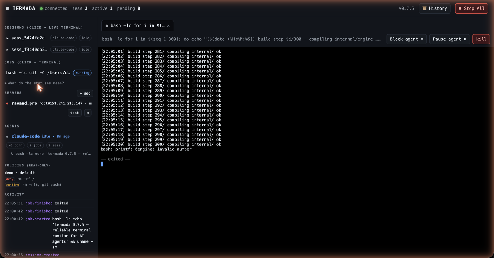
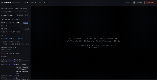

# Termada

**The reliable, transparent terminal runtime for AI agents.**

Termada is a single-binary, local-first runtime that sits between an AI agent and
the terminal (local, and remote over SSH). The agent talks to it over the
[Model Context Protocol](https://modelcontextprotocol.io) and gets a sturdy
toolset instead of a raw shell: commands that don't hang, persistent sessions
that keep `cwd`/env, async jobs with streamed output, PTY input for interactive
prompts, structured results — while a human watches and controls everything from
a live dashboard with a kill-switch and approval queue.

> Status: **0.7.2 — phases 1–4 complete + multi-agent hardening & agent-UX pass.** See [docs/tz/Termada-TZ.md](docs/tz/Termada-TZ.md)



<sub>The live dashboard: every session is a real terminal you can watch and take over (block/pause the agent, type in yourself), alongside the agent panel, read-only policies, a tamper-evident History, and a Stop-All kill-switch.</sub>

<details><summary>CLI flow (install → <code>doctor</code> → <code>dashboard</code>)</summary>



<sub>Regenerate with [`vhs docs/demo.tape`](docs/demo.tape).</sub>
</details>
> for the full spec / roadmap (§30) and [CHANGELOG.md](CHANGELOG.md). License: Apache-2.0.

## What works

**Engine (phase 1)**
- Persistent-shell sessions over a PTY that keep `cwd`/env/venv; one foreground command per session.
- Async jobs: `exec_start` → `job_id`; poll incrementally by a stable cursor; full status state machine + structured errors.
- PTY input for prompts (`exec_write`, `secret` redaction); signals/kill by process group.
- Stateful ANSI/VT cleaning, CR-collapse, bounded retention, best-effort secret redaction.

**Daemon, observability & control (phase 1 pillar)**
- Long-lived daemon with a control-plane over a Unix socket; `serve --stdio` is a thin shim that proxies MCP to it (auto-spawn + in-process fallback) — so multiple agents share one dashboard.
- Live web dashboard: **each job renders as a real terminal** (xterm.js, streamed over SSE) with **operator takeover** — type into a job's PTY, hold the agent's input, or pause the agent's output. Plus approval queue, activity feed, Stop-All; token auth + anti-DNS-rebinding.
- TUI (`termada top`) and a full inspection CLI.
- Tamper-evident, hash-chained, secret-redacted audit log (`termada audit verify`).

**Security & remote (phase 2)**
- Policy engine: argv-level allow/deny/confirm; dangerous commands park in an approval queue (deny-by-default timeout; agents can't self-approve).
- age-encrypted vault (CGO-free); secrets never returned to agents; unlocked into the daemon via `termada unlock`.
- Fleet: `fleet_run` across servers by name/tag with structured per-server results; SSH with vault creds + TOFU host keys.
- Persistent **remote SSH sessions** with transparent reconnect: a dropped link is re-dialled automatically so the session keeps serving commands (the in-flight command is orphaned, not silently lost).
- **Per-agent quotas + non-spoofable identity:** cap concurrent jobs per agent (`defaults.max_jobs_per_agent`), and bind an agent id to a secret token (`agents: [{ id, token }]`) presented via `serve --stdio --token <t>` so `owner` can't be spoofed.
- File tools, recipes, and desktop/Telegram notifications.

**Phase 3 & 4 (now done):** crash-recovery (jobs persist; running jobs recover as
`orphaned`), local-FS snapshots/undo, out-of-process plugins (`<plugin>.<tool>`
over MCP), `termada update` (download → verify SHA-256 → atomic replace) +
goreleaser/CI, and Windows cross-compilation. SSH is exercised against an
in-process test server.

Genuinely remaining: a real Windows ConPTY runtime (cross-compiles today, but the
PTY/signals are stubs), and code-signing/notarization (needs Apple Developer ID /
Windows cert).

## Install

**One line, no Go needed** — downloads the prebuilt binary for your OS/arch (with
SHA-256 verification) to `~/.local/bin`:

```bash
curl -fsSL https://raw.githubusercontent.com/Islomzoda/termada/main/install.sh | sh
```

Pin a version with `TERMADA_VERSION=v0.7.0`, or change the location with
`TERMADA_BIN_DIR=~/bin`. Other ways:

```bash
# Docker (no install) — pull the published image:
docker run --rm -p 7717:7717 ghcr.io/islomzoda/termada serve

# From source (needs Go 1.26+) — clone, then:
TERMADA_FROM_SOURCE=1 ./install.sh        # or:  go build -o ~/.local/bin/termada ./cmd/termada
```

> If `~/.local/bin` isn't on your `PATH`, the installer tells you the one line to add.

## Quick start

```bash
termada serve         # start the daemon + dashboard (prints the URL)
termada dashboard     # open the dashboard (http://127.0.0.1:7717 — no token on your own machine)
```

Let Claude Code use it (one of):

```bash
claude mcp add termada -- termada serve --stdio          # CLI
# or a project .mcp.json (see .mcp.json.example):
# { "mcpServers": { "termada": { "command": "termada", "args": ["serve","--stdio"] } } }
```

Then just ask the agent to run terminal work — it flows through termada, and you
watch/control it live on the dashboard. One daemon is shared across every agent
session and shows them all on one dashboard.

### Or install as a Claude Code plugin

This repo is also a Claude Code plugin marketplace — it bundles the MCP server
config and the usage skill (you still need the `termada` binary on PATH, via the
steps above or Homebrew):

```text
/plugin marketplace add Islomzoda/termada
/plugin install termada@termada
```

<!-- mcp-name: io.github.Islomzoda/termada -->

For listing on MCP registries (official registry, Smithery, etc.) see
[docs/PUBLISHING.md](docs/PUBLISHING.md).

Releases also ship `.deb`/`.rpm` packages (and a Homebrew formula, once the tap is
set up — see [docs/PUBLISHING.md](docs/PUBLISHING.md)).

## Docs

- [docs/SECURITY.md](docs/SECURITY.md) — threat model: what's protected and what isn't.
- [docs/PLUGINS.md](docs/PLUGINS.md) — writing out-of-process tool plugins.
- [docs/tz/Termada-TZ.md](docs/tz/Termada-TZ.md) — full product spec / roadmap.

## Commands

```
termada serve [--stdio]            daemon, or the MCP shim
termada status | top               overview / live TUI
termada jobs [-f] | sessions       list jobs / sessions
termada logs <job> [-f]            stream a job's output
termada kill <job> | stop          kill a job / kill-switch (stop all)
termada pending | approve | deny   human-in-the-loop approvals
termada audit [verify]             audit feed / verify the tamper chain
termada servers | unlock           remote inventory / unlock the vault
termada vault init|set|list|rm     manage credentials
termada snapshot create|list|restore   local-FS safety net (undo)
termada update                     self-update from GitHub releases
```

Plugins: drop an executable in `~/.config/termada/plugins/` that answers
`describe` and `call <tool>` over JSON; its tools appear to agents as
`<plugin>.<tool>` (run with a minimal env — no vault/token access).

## MCP tools (18)

`exec_run` · `exec_start` · `exec_poll` · `exec_write` · `exec_signal` ·
`exec_kill` · `exec_list` · `session_create` · `session_list` · `session_close` ·
`logs_tail` · `file_read` · `file_write` · `recipe_list` · `recipe_run` ·
`server_list` · `fleet_run` · `capabilities`

Commands are passed as an **argv array** (`["echo","hi"]`), not a shell string:
arguments are quoted so shell metacharacters are inert (spec R3).

## Layout

```
cmd/termada            CLI: daemon, shim, inspection/control, vault
internal/engine        sessions, jobs, PTY, status machine, signals, files, recipes
internal/output        cursor buffers, VT cleaner, redaction
internal/policy        argv allow/deny/confirm classification
internal/vault         age-encrypted credential store
internal/audit         hash-chained tamper-evident log
internal/bus           event bus (best-effort observability / durable audit)
internal/daemon        long-lived process: listeners, auth, lifecycle
internal/controlplane  HTTP/JSON API server + client (mcp.Backend over UDS)
internal/dashboard     embedded web UI
internal/tui           `termada top`
internal/fleet         server selection + concurrent aggregation
internal/sshx          SSH runner (vault creds, TOFU host keys)
internal/mcp           MCP JSON-RPC stdio server + tools + backend interface
internal/{config,errs,ids,notify}
docs/tz                product specification
```

## Development

```bash
make vet test    # vet + tests
make race        # tests under the race detector
```

Engine tests exercise a real PTY and `bash`; fleet logic is unit-tested with a
mock runner; the daemon stack is integration-tested end-to-end.
