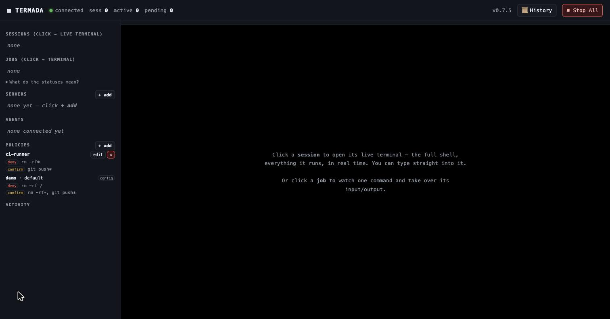

<h1 align="center">Termada</h1>

<p align="center"><b>The reliable, transparent terminal runtime for AI agents.</b></p>

<p align="center">
  <a href="https://github.com/Islomzoda/termada/releases"></a>
  <a href="https://github.com/Islomzoda/termada/actions/workflows/ci.yml"></a>
  <a href="https://registry.modelcontextprotocol.io"></a>
  
  <a href="LICENSE"></a>
</p>

Termada is a single-binary, local-first runtime that sits between an AI agent and
the terminal — local, and remote over SSH. The agent talks to it over the
[Model Context Protocol](https://modelcontextprotocol.io) and gets a sturdy
toolset instead of a raw shell: bounded `exec_run` waits, persistent sessions
that keep `cwd`/env, async jobs with streamed output, PTY input for interactive
prompts, and structured results — while you watch and control active jobs from a
live dashboard with a job kill-switch and an approval queue.

<p align="center">
  
</p>

<p align="center"><sub>The live dashboard: every session is a real terminal you can watch and take over — block or pause the agent, type in yourself — beside the agent panel, policy management, a tamper-evident History, and a Stop-All active-job kill-switch.</sub></p>

---

## Why

Handing an AI agent a raw shell is fragile and opaque: a command blocks on a
prompt and the agent hangs; `cd` and exported env vanish between calls; long
builds flood the context window; and you can't see — let alone stop — what's
running. Termada replaces the raw shell with a runtime that is **reliable** for
the agent and **transparent** for you:

- **Reliable for the agent** — blocking `exec_run` calls use bounded wait budgets
  and return structured output; sessions persist `cwd`/env; long jobs run async
  and stream incrementally instead of dumping; interactive prompts are answerable.
- **Transparent for you** — one dashboard shows every agent and every session as
  a real terminal; commands matched by `confirm` wait for your approval; one
  button stops all active engine jobs.

## Features

**Execution engine**
- Persistent-shell sessions over a PTY that keep `cwd`, env, and venv between commands.
- Async jobs: `exec_start` → `job_id`; poll incrementally by a stable cursor, with sequential bounded pages, a full status state machine and structured errors.
- Answer interactive prompts (`exec_write`, with secret redaction). Local PTY
  jobs support process-group signals/kill; remote SSH interrupt/kill requests
  are best-effort Ctrl-C, not a guaranteed force-kill.
- Clean output: stateful ANSI/VT stripping, CR-collapse, bounded retention, best-effort secret redaction.

**Live control & observability**
- A long-lived daemon with a control plane over a Unix socket; `serve --stdio` is a thin shim that proxies MCP to it — so **multiple agents share one daemon and one dashboard**.
- Web dashboard where **each session renders as a real terminal** (xterm.js, streamed over SSE) with **operator take-over**: type into a job's PTY, hold the agent's input, or pause its output.
- Workspace labels, bounded state bootstrap, cursor-resumable live updates,
  English/Russian controls, and responsive desktop/mobile navigation.
- Approval queue, activity feed, policy/server management, and a **Stop-All**
  kill-switch for active engine jobs.
- A TUI (`termada top`) and a full inspection CLI.
- Synchronously recorded, hash-chained, best-effort-redacted audit log. `termada audit verify` verifies the continuous chain across rotated segments.

**Security**
- Policy engine: every argv word is shell-quoted; allow / deny / confirm matching sees leading assignments, absolute paths, Darwin case variants, known wrappers and explicit shell payloads. Shell scripts/stdin/interactive shells and ambiguous compound commands fail closed when deny/confirm rules exist. Confirm-matched session commands park in a bounded operator queue and time out to deny; non-session actions that require confirmation are refused.
- age-encrypted vault (no CGO); vault APIs never return secret values to agents.
  Values are injected daemon-side and registered for best-effort output
  redaction.
- Per-agent quotas and owner isolation for jobs, sessions, session-scoped remote
  file operations and forwards. Sessions and pending confirmations are capped
  at 32 per owner and 128 total; live forwards at 16 per owner and 64 total.
  Local host paths remain a shared OS/filesystem boundary. Bind
  configured agent ids to secret tokens when identity must not be self-asserted;
  unbound ids remain a local/development fallback.
- Optional `security.run_as` drops local shell processes to a dedicated uid and
  disables daemon-privileged local file tools and daemon-environment inheritance;
  use commands inside that dropped session for local file access. Remote SFTP
  remains available.
- Every TCP `/api/*` request and `/metrics` requires the dashboard token. Operator-only Unix-socket routes require the separate `cli.token` used by the CLI.

**Remote & fleet**
- Persistent **remote SSH sessions** with reconnect — a dropped link is
  re-dialled as a fresh shell so the session can serve new commands. Prior
  cwd/env are lost; an in-flight job becomes `orphaned`, and its uncontrolled
  remote process may still continue. Verify remote state before retrying it.
- `fleet_run` across servers by name or tag with best-effort-redacted,
  structured per-server results. Commands must be non-empty argv arrays and run
  under a shared daemon-wide ceiling of five concurrent fleet targets; a call
  may request less. One call matches at most 256 targets and returns at most
  2 MiB of aggregate result text. SSH uses vault creds, ssh-agent, or on-disk keys, with
  serialized, fsynced TOFU host-key pinning that fails closed on a malformed
  `known_hosts` file.
- Owner-scoped local-to-remote port forwards. Opening one is policy-gated and
  rolled back unless its start audit record is durable; listeners are
  loopback-only and bounded to 64 simultaneous connections per forward.

**Operations**
- Crash recovery (jobs persist; running jobs come back as `orphaned`), bounded local-FS snapshots/undo, desktop notifications and outbound-only Telegram notifications.
- Out-of-process plugins exposed to agents as `<plugin>.<tool>`. Plugins are
  trusted executables, not a security sandbox; calls are policy-gated and do not
  start unless their start audit record is durable.
- `termada update` — bounded self-update from GitHub releases on Unix (mandatory SHA-256 verification, optional Ed25519-signed checksums, exact-member extraction, atomic replace). Windows reports an explicit manual-install path because a running `.exe` cannot be replaced atomically.

> **Not yet:** a native Windows ConPTY runtime (cross-compiles today, but PTY and
> signals are stubs) and code-signing / notarization.

## Install

**One line, no Go needed** — downloads a prebuilt macOS or Linux `amd64`/`arm64`
binary (SHA-256 verified) to `~/.local/bin`:

```bash
curl -fsSL https://raw.githubusercontent.com/Islomzoda/termada/main/install.sh | sh
```

Pin a version with `TERMADA_VERSION=vX.Y.Z`, or change the location with
`TERMADA_BIN_DIR=~/bin`. If `~/.local/bin` isn't on your `PATH`, the installer
prints the one line to add.

<details><summary>Other ways — Docker, Homebrew, packages, source</summary>

```bash
# Docker (current published image: linux/amd64). Keep the published port on
# host loopback; the image binds 0.0.0.0 only inside its network namespace:
docker run --rm --platform linux/amd64 -p 127.0.0.1:7717:7717 ghcr.io/islomzoda/termada

# Persistent container state runs as uid/gid 10001. A fresh named volume is
# initialized with the image's ownership:
docker run --rm --platform linux/amd64 -p 127.0.0.1:7717:7717 \
  --mount type=volume,src=termada-data,dst=/home/termada/.config/termada \
  ghcr.io/islomzoda/termada

# Homebrew:
brew install Islomzoda/tap/termada

# From source (needs Go 1.26.5+):
TERMADA_FROM_SOURCE=1 ./install.sh
# or:  go build -o ~/.local/bin/termada ./cmd/termada
```

The Docker command starts the daemon directly; open the tokenized URL printed in
its logs. The native CLI commands below apply when the binary is installed on the
host.

Releases also ship `.deb`, `.rpm`, and manual Windows archives on the
[releases page](https://github.com/Islomzoda/termada/releases). The Windows
binary cross-compiles, but native PTY execution still awaits a ConPTY backend.

</details>

## Quick start

```bash
termada serve                    # start the daemon; prints a tokenized dashboard URL
termada dashboard --open         # print and open a fresh tokenized URL
```

The dashboard bootstrap stores the token in browser session storage and removes
it from the address bar. Static assets are public on loopback, but every TCP
`/api/*` request and `/metrics` requires the token. The legacy
`dashboard.local_trust` setting is deprecated and does not bypass API auth.

Connect it to your agent — this is a **one-time, user-wide** step. You do it once
per user account and every project gets Termada automatically; there's nothing
to copy into each repo.

For Claude Code, one command does it:

```bash
claude mcp add --scope user termada -- termada serve --stdio
```

Using a different agent (or prefer a file)? Add this once to your **global** MCP
config — see [`.mcp.json.example`](.mcp.json.example):

```json
{ "mcpServers": { "termada": { "command": "termada", "args": ["serve", "--stdio"] } } }
```

That's it. From now on, just ask the agent to do terminal work — it flows through
Termada while you watch and control it live. The one shared daemon serves every
project and every agent session, all on the same dashboard.

Configuration is strict: unknown/unsupported fields fail startup. Values written
as `${NAME}` are expanded from the environment, and an unset referenced variable
is an error rather than an empty credential. Leave optional credential fields out
until their variables are available.

### Reach remote servers through Termada

For the agent to operate a remote box **through Termada** (observable, reconnecting,
policy-gated) instead of shelling out to raw `ssh`, register the server once — then
it's reachable **by name**, no IP and no raw ssh client.

Add it to `config.yaml` (see [`config.example.yaml`](config.example.yaml)) and
restart the daemon:

```yaml
servers:
  - name: prod
    host: prod.example.com        # hostname or IP of your server
    user: deploy
    # auth is OPTIONAL: a vault entry name for a Termada-stored credential.
    # Omit it to try SSH_AUTH_SOCK plus unencrypted ~/.ssh/id_ed25519,
    # id_ecdsa, or id_rsa. Termada does not interpret arbitrary ssh config.
    # auth: prod-ssh-key
    tags: [web]
```

…or add it live from the dashboard (**Servers → Add**). Confirm it's registered:

```bash
termada servers          # lists registered servers by name
```

Now the agent reaches it by name:

- **a remote shell session** — `session_create(target="prod")`, then run `exec_run` / `exec_start` in that session (state persists while connected; after a link drop Termada reconnects a fresh shell, but an orphaned remote process may still be running);
- **one command across servers** — `fleet_run(command=[...], servers=["prod"])` (or by tag).
- **a loopback TCP tunnel** — `port_forward(server="prod", remote_host="127.0.0.1", remote_port=5432)`, then close its returned id with `port_forward_close` when done.

### Make the agent actually use Termada

Agents like Claude Code and Cursor ship with a built-in shell and will reach for it
(and for raw `ssh`) by default. Two things steer them to Termada:

1. **Install the usage skill** — the plugin below, or [`skills/termada`](skills/termada/SKILL.md). It teaches the agent how to drive the tools (and to route remote work through registered servers instead of `ssh`).
2. **Add a project rule** so the agent *prefers* Termada. Put this in `CLAUDE.md`
   (Claude Code), `.cursor/rules` (Cursor), or your agent's system prompt:

   > Use the Termada MCP tools for **all** shell and remote work — `exec_run` /
   > `exec_start` for commands, `session_create(target="<server>")` and `fleet_run`
   > for remote servers. Do **not** use the built-in shell or a raw `ssh` client:
   > everything must go through Termada so it is observable, reconnecting, and
   > policy-gated. If a server isn't in `server_list()`, ask me to register it
   > rather than falling back to `ssh`.

<details><summary>Install as a Claude Code plugin</summary>

This repo is also a Claude Code plugin marketplace — it bundles the MCP server
config and the usage skill (you still need the `termada` binary on `PATH`):

```text
/plugin marketplace add Islomzoda/termada
/plugin install termada@termada
```

</details>

<!-- mcp-name: io.github.Islomzoda/termada -->

## MCP tools

Commands are passed as an **argv array** (`["echo", "hi"]`), never a shell string,
so metacharacters are literal unless you explicitly invoke a shell such as
`["bash", "-lc", "..."]`. Explicit shell payloads still pass through policy;
ambiguous compound payloads fail closed when deny/confirm rules are present.

| Group | Tools |
| --- | --- |
| Run | `exec_run` · `exec_start` · `exec_poll` · `exec_write` · `exec_signal` · `exec_kill` · `exec_list` |
| Sessions | `session_create` · `session_list` · `session_close` |
| Files & logs | `file_read` · `file_write` · `logs_tail` |
| Recipes | `recipe_list` · `recipe_run` |
| Remote | `server_list` · `fleet_run` · `port_forward` · `port_forward_list` · `port_forward_close` |
| Plugins | `<plugin>.<tool>` names discovered at daemon startup |
| Meta | `capabilities` |

## CLI

```text
termada serve [--stdio]              daemon, or the MCP shim
termada dashboard [--open]           print / optionally open the dashboard URL
termada top | status                 live TUI / overview
termada jobs [-f] | sessions         list jobs / sessions
termada logs <job> [-f]              stream a job's output
termada kill <job> | stop            kill one job / stop all active engine jobs
termada pending | approve | deny     human-in-the-loop approvals
termada audit [verify]               audit feed / verify active + rotated chain
termada servers | unlock             remote inventory / unlock the vault
termada vault init|set|list|rm|reset manage credentials
termada snapshot create|list|restore local-FS safety net (undo)
termada setup                        install user-scoped Claude MCP config
termada doctor                       health check
termada service install|uninstall|status  run the daemon at login
termada update                       Unix self-update; Windows prints manual path
```

## Documentation

- [docs/SECURITY.md](docs/SECURITY.md) — threat model: what's protected and what isn't.
- [docs/PLUGINS.md](docs/PLUGINS.md) — writing out-of-process tool plugins.
- [docs/PUBLISHING.md](docs/PUBLISHING.md) — release & MCP-registry process.

## Architecture

A single daemon owns all state; agents connect through a stdio shim, and you
observe through the dashboard, TUI, or CLI — all over the same control plane.

```text
cmd/termada            CLI: daemon, shim, inspection/control, vault
internal/engine        sessions, jobs, PTY, status machine, signals, files, recipes
internal/output        cursor buffers, VT cleaner, redaction
internal/policy        argv allow/deny/confirm classification
internal/vault         age-encrypted credential store
internal/audit         hash-chained tamper-evident log
internal/bus           event bus (observability + durable audit)
internal/daemon        long-lived process: listeners, auth, lifecycle
internal/controlplane  HTTP/JSON control-plane server + client
internal/dashboard     embedded web UI
internal/tui           termada top
internal/fleet         server selection + concurrent aggregation
internal/sshx          SSH runner (vault / agent / key auth, TOFU host keys)
internal/mcp           MCP JSON-RPC stdio server + tools
```

## Development

```bash
make vet test    # vet + tests
make race        # tests under the race detector
```

Engine tests exercise a real PTY and `bash`; fleet logic is unit-tested with a
mock runner; the daemon stack and SSH are integration-tested end-to-end.

## License

[Apache-2.0](LICENSE).
