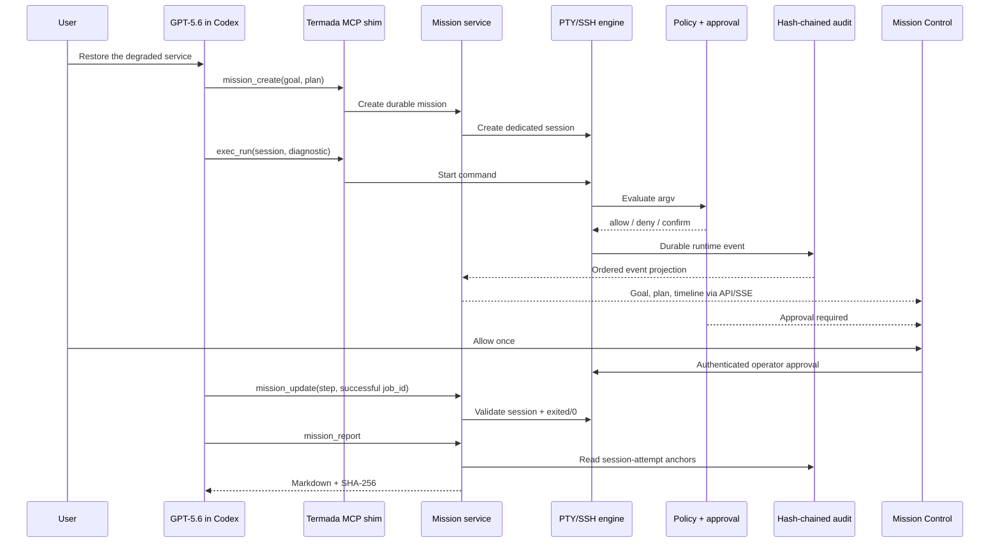

# Mission Control Architecture

Termada Mission Control is an orchestration/evidence layer above the existing execution engine. It does not introduce a second shell path.

## Components

- `internal/mission`: bounded model, atomic JSON store, owner isolation, transitions, interruption/resume, runtime projection, Markdown reporting.
- `internal/engine`: unchanged authority for sessions, jobs, PTY/SSH, policy evaluation, quotas, input, signals, and lifecycle.
- `internal/audit`: authoritative ordered durable record with fsync, rotation, sequence, and hash chain.
- `internal/controlplane`: owner-scoped mission routes plus authenticated operator report/download and approval access.
- `internal/mcp`: six mission tools and evidence-bearing `job_id` in every `exec_run` result.
- `internal/dashboard`: compact mission list, plan, timeline, pinned approval, reconnect/stale states, and report download.

## Data And Recovery

The mode-`0600` mission store keeps at most 128 missions, 24 steps per mission, and 512 redacted runtime events. Terminal output is not copied into it. A mission records all session attempt ids; after a daemon restart, any non-terminal mission becomes `interrupted`. `mission_resume` creates a fresh shell and preserves prior evidence.

Audit is written before the mission projection in one ordered reliable sink. If either durable write fails, new execution fails closed. Reports query up to the bounded retained audit tail, include matching record sequence/hash anchors, exclude prior report-generation records for deterministic output, then record the report SHA-256 as `mission.report_generated`.

## Trust Boundary

The model can create, read, update, resume, and report only its owner-scoped missions. It cannot call approve/deny. The dashboard or human CLI authenticates separately as an operator. `passed` is not an assertion-only field: the service resolves the referenced job, checks it belongs to a session attempt for that mission, and requires `exited/0`.

See [SECURITY.md](../SECURITY.md) for the complete threat model and limitations.
