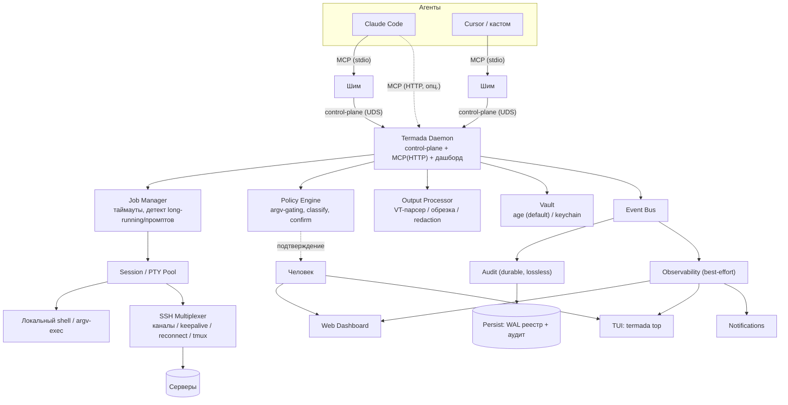

# Termada — Продуктовая спецификация (v0.x)

> **Название:** **Termada**
> **Слоган:** «The reliable, transparent terminal runtime for AI agents»
> **Тип продукта:** Open-source рантайм исполнения для AI-агентов в терминале (локально и на удалённых серверах) с наблюдаемостью, безопасностью и креденшелами из коробки.
> **Версия документа:** 2.0 — **честный 0.x с фазовым планом релизов** (переработка v1.0 по итогам инженерного ревью).
> **Лицензия:** Apache-2.0
> **Транспорт:** Model Context Protocol (MCP)
> **Принцип:** один бинарь, local-first, без облака. Легко для людей — надёжно для агентов.

> **Что изменилось относительно v1.0 (кратко):** документ переведён из «всё-в-первом-релизе production» в фазовый 0.x; разведена семантика восстановления local vs remote; модель исполнения построена на **argv без интерпретирующего shell** как граница безопасности; зафиксирован **daemon-инвариант**; абсолюты безопасности заменены **честной threat-model**; исправлен PTY-стек (§26); контракт §22 доопределён (полный enum статусов, каталог ошибок, курсорная модель, идемпотентность); Windows понижен до beta; snapshots/undo и плагины вынесены за 0.x. Развёрнутое обоснование — в §0 и в разделах по месту.

-----

## 0. Решения ревью (зафиксированные развилки)

Эти решения — основа всего документа. Каждое разрешает противоречие/переобещание исходной v1.0.

|#|Развилка|Решение 0.x|
|-|--------|-----------|
|R1|Восстановление после краша|Персистится **реестр** (метаданные джоб/сессий). Сам **процесс** переживает краш бинаря **только** в tmux-бэкенде (remote). Локальные PTY-джобы после краша помечаются `orphaned`, а не `running`. Graceful restart (контролируемый) сохраняет порядок; внезапный краш локально = потеря живого потока (честно задокументировано).|
|R2|Объём|Это **0.x**, не «законченный production». §30 — фазовый план из 4 фаз. Часть фич явно отложена.|
|R3|Граница безопасности команд|Исполнение **argv напрямую**, без интерпретирующего shell по умолчанию для policy-gated команд; в allow-режиме запрещены shell-метасимволы. Allowlist — фильтр от случайностей + опора на human-confirmation для опасного. Persistent-shell-сессии (для `cd`/env) — отдельный явный режим с явной пометкой «политика здесь best-effort».|
|R4|Процессная модель|**Daemon-инвариант**: `termada serve` — долгоживущий процесс (control-plane + дашборд на UDS/127.0.0.1). stdio-подключение агента — **тонкий шим-прокси** к локальному daemon. Мультиагент/дашборд/kill-all/CLI работают только через daemon.|
|R5|Vault|Дефолтный бэкенд — **encrypted_file на age** (чистый Go, CGO-free). Daemon держит разблокированный ключ в памяти; явная граница threat-model: **не защищает от локального root/ptrace**. Keychain — opt-in best-effort. Автономный recovery без unlock возможен только при keychain-кэше деривированного ключа; иначе encrypted_file требует ручной unlock (честно задокументировано).|
|R6|Windows|0.x: **beta/best-effort**. First-class — macOS + Linux. Windows-движок через ConPTY и отдельную VT-обработку — следующая фаза.|
|R7|Авто-ответы на промпты|Привязаны **только** к подтверждённому `awaiting_input` и к **хвосту** промпта (последняя строка), не к подстроке во всём выводе. **Host-key убран** из дефолтных auto_answer — security-критичные промпты идут в очередь подтверждений / pinned-key.|
|R8|Snapshots/undo и плагины|**Отложены за 0.x.** Остаются рецепты (RC-1). Snapshots при возврате — только локальная ФС/git-stash. Плагины — отдельная мини-спека (out-of-process/WASM + capability-модель) в поздней фазе.|

-----

## 1. Видение

Termada — слой между AI-агентом и терминалом (локальным или удалённым через SSH), который делает работу агента в shell **надёжной, быстрой, безопасной и прозрачной для человека**.

Агент общается с Termada по MCP и получает не «голый shell», а устойчивый набор инструментов: запуск команд без зависаний, живые сессии с сохранением состояния, фоновые задачи, стриминг вывода, ответы на интерактивные промпты, безопасный доступ к продакшену.

Человек получает **живой пульт управления**: дашборд и/или TUI с реалтайм-картиной действий агентов, их доступа, и возможностью в один клик остановить или вмешаться.

-----

## 2. Проблема

Агент работает с терминалом через примитивный «выполни — верни весь вывод» вызов, и это ломается: долгие команды блокируют навсегда; интерактивные промпты подвешивают; каждый вызов — новый shell (теряются `cd`/env/venv); огромный вывод режется; SSH рвётся/реконнектится; креды светятся в чате; **человек не видит, что происходит**. Termada устраняет корень этих проблем.

-----

## 3. Рамки и принципы

### Принципы
- **Надёжность исполнения превыше всего** — агент не виснет, не теряет состояние.
- **Прозрачность = доверие** — человек всегда видит и может остановить.
- **Vault-секрет не покидает движок** — агенту отдаются инструменты, не управляемые vault-креды. *(Граница честная: см. §3a threat-model — секреты в ФС/окружении хоста агент через `exec`/`file_read` всё равно может прочитать.)*
- **Local-first, без облака** — всё на машине пользователя, ноль внешней телеметрии по умолчанию.
- **Один бинарь, zero-config старт.**
- **Универсальность** — любой MCP-агент.

### В рамках 0.x
См. §30 (фазовый план). Фаза 1 — локальный движок + наблюдаемость; затем SSH/vault/политики; затем аудит/восстановление; затем дистрибутивы/расширяемость.

### Сознательно вне рамок
Облачный SaaS, мультиарендность, SSO/SAML, кластер/HA, k8s-оператор, тяжёлые RBAC-иерархии. **Отложено за 0.x:** плагины, snapshots/undo, авто-апдейт, нотаризация/подпись как блокер релиза, Windows-паритет.

### 3a. Threat-model (заменяет абсолюты v1.0)

Termada даёт **честный best-effort**, а не абсолютные гарантии. Что гарантируется и что нет:

|Гарантия|Статус|Граница|
|--------|------|-------|
|Vault-секреты не возвращаются агенту и не попадают в дашборд/аудит|**Да**|Только секреты, которыми управляет vault. Секреты в ФС (`~/.ssh`, `~/.aws`), env, `config.yaml` агент может прочитать через `exec`/`file_read` — это **вне** гарантии. Митигейшен: запуск сессий под отдельным uid без доступа к этим путям (фаза 2+).|
|Redaction вывода|**Best-effort**|Известные форматы (PEM/JWT/AWS/GCP/api-key/base64-токены) + детерминированная маскировка известных vault-значений + overlap-буфер на границах чанков. Произвольные секреты могут просочиться.|
|Tamper-evident аудит|**Evident, не proof**|Hash-chain защищает от подделки агентом/процессом без доступа к ключу. От локального root, переписывающего цепочку с головы, защищает только при ключе в keychain/TPM + внешний якорь. Формулировка — «tamper-**evident**».|
|Секретный ввод (sudo/SSH-пароль из vault)|**Не логируется**|Vault-подстановка и помеченный секретным `exec_write` **никогда** не пишутся в аудит/реплей и не эхоятся. Реплей PTY исключает секретные сегменты.|
|At-rest шифрование кредов|**Да**|age/AES-GCM. **At-runtime** разблокированный ключ живёт в памяти daemon — против локального root/ptrace не защищён (явная граница).|
|Граница политик|**argv-уровень**|См. R3. Persistent-shell-режим ослабляет границу — помечается явно.|

-----

## 4. Целевые пользователи

|Персона|Сценарий|Что важно|
|-------|--------|---------|
|Разработчик с агентом локально|Гоняет Claude Code / Cursor у себя|Агент не виснет на dev-серверах/промптах, не теряет `cd` (**персона №1, фаза 1**)|
|Девопс / соло с продом|Агент делает операции на сервере|Безопасность кредов, аудит, подтверждение опасного, наблюдение (**фаза 2–3**)|
|Малая команда|Поднимает всё локально|Простота, один бинарь, дашборд|
|Контрибьютор OSS|Расширяет под свой стек|Чёткий интерфейс плагинов (**фаза 4**)|

-----

## 5. Глоссарий

- **Core / daemon Termada** — основной долгоживущий процесс: control-plane + событийная шина + наблюдаемость + MCP-эндпоинт.
- **Шим** — тонкий stdio-процесс, который MCP-клиент спавнит; проксирует вызовы в локальный daemon.
- **Сессия** — именованный контекст исполнения (`id`, `target`, `cwd`, `env`, `owner`). Может быть persistent-shell (живой shell с состоянием) или argv-сессия (команды через прямой exec).
- **Джоба** — конкретный запуск команды (`id`, `status`, потоки вывода, `exit_code`/сигнал).
- **PTY** — псевдотерминал.
- **Vault** — локальное зашифрованное хранилище кредов.
- **Event Bus** — внутренняя шина событий; разведена на durable-канал (аудит) и best-effort-канал (наблюдаемость).
- **Курсор** — opaque-монотонная позиция в потоке вывода джобы; стабилен при graceful restart.
- **Рецепт** — именованный макрос команд. **Fleet** — группа серверов.

-----

## 6. Каталог болей агента

(Без изменений по сути — это сильная часть документа. Решения см. в соответствующих разделах.)

|#|Боль|Решение|
|-|----|-------|
|P-1|Долго нет ответа: работает/завис/ждёт ввода?|Стриминг + явный `status` (полный enum, §22a).|
|P-2|Команда ждёт ввод, не могу ответить|Детект `awaiting_input` (best-effort) + текст. Ответ через `exec_write` в PTY (R7).|
|P-3|`cd` сбросился|Persistent-shell-сессия: `cwd`/env/venv сохраняются.|
|P-4|Dev-сервер блокирует всё|Async-модель + детект long-running → `backgrounded` + override (`mode`).|
|P-5|Вывод режется посередине|Умная обрезка head+tail, маркер опущенного.|
|P-6|ANSI/спиннеры шумят|Stateful VT-обработка, схлопывание CR. Alt-screen → live-стрим дашборда.|
|P-7|Ошибка зарыта в build-шуме|Извлечение хвоста, опц. саммари.|
|P-8|Не понимаю exit-code|Структурированный результат `{status, exit_code, …}` (полный enum).|
|P-9|Секрет утёк в контекст|Best-effort redaction (§3a).|
|P-10|SSH отвалился посреди задачи|Persistent SSH + tmux-переприцепка (фаза 2; R1).|
|P-11|Каждая команда реконнектится|In-process мультиплексинг каналов + keepalive (не ControlMaster, см. §14).|
|P-12|Одно на 5 серверах — долго|`fleet_run` (фаза 2) с per-server отчётом.|
|P-13|Фон потерялся|Реестр джоб: `exec_list`/`logs_tail`/`exec_kill`.|
|P-14|Таймауты|Адаптивные по классу команды (таблица в конфиге).|
|P-15|Слежу за логом|`logs_tail` инкрементально по курсору; SSE-стрим — HTTP-эндпоинт (§22).|
|P-16|Что уже выполнил|История джоб в сессии (персист реестра).|
|P-17|Текстовый блоб|Везде структурированные ответы.|

-----

## 7. Столпы продукта

1. **Наблюдаемость и контроль человека** (фаза 1).
2. **Надёжный движок исполнения** (фаза 1).
3. **Чистый и управляемый вывод** (фаза 1).
4. **Интерактивность без зависаний** (фаза 1).
5. **Удалённый доступ** (фаза 2).
6. **Безопасность и креды** (фаза 2–3).
7. **Удобство: рецепты, один бинарь** (фаза 1–4).

-----

## 8. Наблюдаемость и контроль человека

Все поверхности питаются Event Bus. **Каналы разведены по гарантиям** (см. §8.7).

### 8.1 Live Dashboard (локальный web на `127.0.0.1`/UDS)
Поднимается daemon-ом (`termada serve`). Реалтайм: активность агентов; сессии (`cwd`, окружение, число джоб); джобы (агент/команда/сервер/статус/длительность/exit, клик → стрим); live-логи; серверы/fleet; **доступ агента** (allow/deny, политика); лента аудита; **очередь подтверждений** (Approve/Deny); **вмешательство** (пауза/kill джобы, закрытие сессии, отзыв доступа, **Stop All**).

**Аутентификация дашборда (исправление M12):** автогенерируемый токен ≥128 бит (хранение 0600/keychain), передача через `Authorization`-header или одноразовый loopback-redirect (не постоянный URL в истории браузера); обязательная проверка `Origin`/`Host` (anti-DNS-rebinding); CSRF-токены на мутирующие действия; опц. Unix-domain-socket вместо TCP для локальной изоляции; SSE/metrics защищены тем же токеном.

### 8.2 TUI (`termada top` / `termada watch`)
То же в терминале (как `htop` для агентов). Сетевой клиент control-plane (через daemon), независим от транспорта агента.

### 8.3 Уведомления (push)
Desktop + опц. Telegram/Slack: нужен аппрув / джоба упала / агент подключился / затронут прод. **Headless:** desktop-канал авто-выключается; если нет сетевого канала — аппрув эскалируется только в дашборд/TUI (явно сообщать). Redaction применяется к push; минимизация данных по умолчанию. Внешние каналы — единственное исключение из local-first (помечено).

### 8.4 CLI-инспекция
`termada status|jobs [-f]|logs <id> -f|sessions|audit|access|kill <id>|stop --all`. Все — сетевые клиенты daemon.

### 8.5 Аудит и реплей
Append-only журнал, реплей сессии (asciinema-стиль), экспорт. **Tamper-evident** (подпись + цепочка; граница — §3a). Секреты маскируются в журнале/дашборде/реплее; секретный ввод исключён из потока (R7, §3a).

### 8.6 Метрики (опц.)
Prometheus `/metrics`, по умолчанию выключено, защищён токеном.

### 8.7 Backpressure и разведение каналов (исправление M6)
- **Аудит** — синхронный durable lossless путь: fsync до подтверждения, single-writer-сериализация (для целостности tamper-цепочки).
- **Наблюдаемость** (дашборд/TUI) — best-effort: bounded-очереди, coalescing прогресс-баров, drop-oldest при переполнении; медленный клиент дропает кадры или получает снапшот+догон, **не блокирует чтение PTY**.
- Ring-buffer вывода на джобу с конфигурируемым размером.
- Два представления потока: **raw-for-replay** и **cleaned-for-agent** — явно разведены.

### Требования
- **OB-1** Реалтайм всех сессий/джоб/агентов. **OB-2** Live-стрим вывода. **OB-3** Экран доступа агента. **OB-4** Очередь подтверждений (модель — §18a). **OB-5** Kill-switch (семантика — §18a). **OB-6** Аудит + реплей, tamper-evident, redaction. **OB-7** Push (desktop + опц. сетевые). **OB-8** CLI-инспекция. **OB-9** Без облака, на loopback/UDS.

-----

## 9. Движок исполнения

- **EX-1** Исполнение в живой сессии поверх PTY (persistent-shell) **или** прямой argv-exec под PTY (policy-gated режим, R3).
- **EX-2** Async: `exec_start` отдаёт `job_id` сразу, не блокируя.
- **EX-3** Поллинг статуса/инкрементального вывода (`exec_poll`) по **курсору** (модель — §11a).
- **EX-4** Ввод в **PTY master** джобы (`exec_write`) — не в stdin-pipe (исправление M19: sudo/ssh читают `/dev/tty`).
- **EX-5** Сигналы/убийство (`exec_signal`/`exec_kill`) — через process-group, кроссплатформенный маппинг (§18b).
- **EX-6** Реестр активных/недавних джоб (`exec_list`).
- **EX-7** `exec_run` с авто-таймаутом и авто-бэкграундом, **с override `mode`** (auto|foreground|background).
- **EX-8** Лимиты параллелизма: **раздельные** cap для foreground и для долгоживущих background; при превышении — ошибка `parallelism_exceeded` (не блокировка); per-agent квоты (фаза 2); ресурсные guard-rails (лимит буфера на джобу).
- **EX-9** (нов.) GC забытых джоб: TTL без поллинга → авто-detach в `recent` (опц. авто-kill). Гарантия дренажа PTY до EOF перед терминальным статусом (исправление M21: не терять финальный чанк с ошибкой).

## 10. Сессии и состояние

- **SS-1** Persistent-shell-сессия: `cwd`/env сохраняются между вызовами.
- **SS-2** Несколько именованных сессий (`session_create`/`list`/`close`).
- **SS-3** Сохранение venv/nvm/окружения внутри сессии.
- **SS-4** Дефолтная авто-сессия **per-agent**, если агент не указал явно.
- **SS-5** (нов., исправление M5) **Одна foreground-команда на сессию** в каждый момент; foreground сериализуется (мутирует `cwd`/env только foreground-цепочка). Конкурентный `exec` в занятую сессию → `session_busy` (или очередь). Фон выносится в собственный PTY со снапшотом env.
- **SS-6** (нов.) **Владелец** сессии = `agent_id` создателя; чужой доступ запрещён (или явный `shared`-флаг). Эксклюзивность stdin: в stdin джобы пишет только владелец.

## 11. Обработка вывода

- **OUT-1** Стриминг по курсору. **OUT-2** Умная обрезка (head+tail, лимит, маркер опущенного). **OUT-3** Stateful **VT-парсер** (не regex): нормализация на границах чанков/UTF-8, CR-collapse, обработка частичных ESC-последовательностей; alt-screen (vim/htop/less) → снимок мини-VT или явное «fullscreen не поддерживается в тексте, см. стрим». **OUT-4** Режимы «только stderr» (где потоки разделимы), «только хвост», опц. саммари. **OUT-5** Best-effort redaction (§3a).

### 11a. Курсорная модель (исправление M1)
- На джобу — append-only лог вывода на диск (segmented/ring с per-job и global cap).
- **Курсор** = стабильный байтовый офсет, opaque-строка, монотонный, переживает graceful restart.
- Устаревший курсор → структурированная ошибка `cursor_expired` с earliest доступным курсором + gap-маркер.
- Персистится: метаданные + файл потока с ротацией. TTL и max-размер хранимого вывода recent-джоб — в конфиге.
- Один источник питает и `logs_tail`, и live-стрим, и реплей.

## 12. Интерактивность

- **IN-1** Детект `awaiting_input` (best-effort: тишина + паттерн хвоста промпта + живость процесса) → флаг + текст.
- **IN-2** Авто-ответы только на **подтверждённый** `awaiting_input` и по **хвосту** промпта (R7); каждый авто-ответ логируется (с маскировкой). Дефолты — только безопасные `[Y/n]`; host-key и пароли **не** авто-yes.
- **IN-3** Подстановка пароля sudo/SSH из vault — в PTY master, только при высокой уверенности password-промпта, гарантированно без эха и без записи в аудит/реплей. Для sudo — рассмотреть `SUDO_ASKPASS`/`sudo -A` с askpass-хелпером под контролем Termada (надёжнее тайминга записи).

## 13. Long-running и таймауты (исправление M8)

- **LR-1** Авто-детект демонов/вотчеров по **нескольким** сигналам (listening-сокет + молчание + паттерн + живость CPU/IO) → `backgrounded` + событие. Всегда есть override `mode`.
- **LR-2** Адаптивные таймауты по **таблице классов** в конфиге (build/install/test/db/network/default), парсинг по первому токену с разворачиванием обёрток (sudo/env/time/nice). Приоритет: явный `timeout_ms` вызова > per-class > глобальный > silence.
- **LR-3** Kill-по-тишине — **не единственный** сигнал; `awaiting_input` **исключён** из silence-kill (отдельный `input_timeout`). Любой авто-kill → событие с `reason` в аудит и в ответ агенту (`status=killed, reason`).
- **LR-4** (нов.) Golden-тесты эвристик с precision/recall (RL-1).

-----

## 14. Удалённый доступ (SSH) — фаза 2

- **RM-1** SSH по ключу/паролю из vault.
- **RM-2** (исправление M1/m1) **In-process мультиплексирование**: одно постоянное соединение на сервер с несколькими параллельными каналами + keepalive (свой тикер `keepalive@openssh.com`). **Не** ControlMaster (это фича OpenSSH CLI, не `x/crypto/ssh`). Системный OpenSSH CLI как рантайм-зависимость не используется. Обрыв рвёт все каналы соединения; переоткрытие восстанавливает все джобы соединения.
- **RM-3** Авто-reconnect — **прозрачен только для tmux-обёрнутых джоб** (R1). Прямой PTY-stream обрыв не переживает (процесс на сервере умрёт) — честно.
- **RM-4** Исполнение в `tmux`/`screen` с переприцепкой. **Fallback — дефолт**; авто-установка tmux — opt-in через аппрув (не тихий sudo на проде). Режим `tmux: auto|require|off` в server-config; при отсутствии — `persistence:none` явно в ответе.
- **RM-5** Опц. (advanced, отложено): локальный SSH CA с короткими сертификатами.
- **RM-6** Host-key TOFU; security-критичные промпты — в очередь подтверждений/pinned-key, **не** авто-yes (R7, согласовано с §24).

### 14a. tmux-исполнение и структурированный результат (исправление M9)
Не через `send-keys`/`capture-pane` (слитые потоки, нет канала exit-code, гонки). Вместо: обёртка-раннер пишет stdout/stderr/exit-code в файлы/FIFO на сервере (читаются по тому же SSH-каналу) **или** tmux control-mode (`tmux -CC`). Персист last-seen cursor; дыра в scrollback → явный `truncated`/`gap`. Exit-code — из обёртки, не из scrollback. Kill-switch шлёт сигнал процессу **внутри** tmux (`send-keys C-c` + kill pane), не только рвёт SSH. Две модели исполнения явно разведены: прямой-PTY (точный детект промптов, не переживает обрыв) и tmux-backed (переживает обрыв, детект деградирует).

## 15. Fleet / мульти-сервер — фаза 2

- **FL-1** `fleet_run` — параллельный fan-out, агрегат. **Схема (исправление M10):** `results:[{server, status: ok|nonzero_exit|unreachable|timeout|conn_lost|denied, exit_code?, stdout, stderr, duration_ms, error?}]` + сводка `{total, ok, failed, by_reason}` + общий `status`; per-server timeout, не блокирующий fan-out; **`fleet_run` НЕ атомарен** (явно).
- **FL-2** Группы и теги серверов.
- **FL-3** Ограничение параллелизма; каждый шаг рецепта и каждая fleet-цель проходят политику/классификацию **индивидуально**; stop-on-error по умолчанию.

## 16. Файлы — фаза 2

- **FS-1** `file_read` с лимитом. **FS-2** `file_write`/`file_upload`. **FS-3** `file_download` (добавлен в §22), port-forward хелперы. Адресация remote-файлов — везде через `session?`, привязанный к target/серверу. **Policy Engine распространяется на `file_*`** (path allow/deny с canonicalize + anti-traversal, запрет секретных путей — исправление C2).

## 17. Креденшелы и vault — фаза 2

- **CR-1** Локальное зашифрованное хранилище; vault-секрет **не** возвращается агенту/в дашборд/аудит (граница — §3a).
- **CR-2** Дефолт — **encrypted_file на age** (CGO-free). Keychain (macOS/libsecret) — opt-in best-effort (на macOS нативный Keychain требует CGO; CGO-free `go-keyring` обходит ACL — отмечено).
- **CR-3** CLI-визард (`termada setup`), опц. локальная web-форма.
- **CR-4** Ротация и удаление.
- **CR-5** (нов., исправление M13) Runtime-модель: разблокированный ключ в памяти daemon, TTL разблокировки, idle-relock, `mlock`/zeroize, расшифровка на момент использования. Автономный recovery/reconnect: при keychain-кэше — возможен; при encrypted_file без unlock — **не** поддерживается (джобы, ждущие unlock, видны в дашборде).

## 18. Безопасность и политики

- **SEC-1** Allow/deny команд (см. R3 — граница на argv-уровне; allow-режим запрещает метасимволы `; | & $ \` $() > newline`; матч по `argv[0]`+аргументам с canonicalize). Persistent-shell-режим — best-effort, помечен.
- **SEC-2** Классификация опасного → human-confirmation (§18a). **SEC-3** Tamper-evident аудит (граница — §3a; ключ в keychain/TPM). **SEC-4** Hot-reload политик: атомарная замена + валидация перед применением + откат к рабочей версии при ошибке (расширение RE-6), fail-closed, явное правило для in-flight джоб/pending-аппрувов. **SEC-5** Least privilege. **SEC-6** Опасное по умолчанию требует подтверждения. **SEC-7** Управление кредами/серверами — только CLI, не MCP-инструмент. **SEC-8** (нов.) `config.yaml`/vault — вне досягаемости сессий агента (другой uid, 0600); hot-reload проверяет owner/права (агент не может переписать свою политику через `file_write`).

### 18a. Очередь подтверждений и kill-switch (исправление M11/OB-4/OB-5)
- Неизменяемый снэпшот точной команды в карточке; исполняется ровно он (no TOCTOU).
- Аппрув привязан к `job_id`+`agent_id`+хешу команды.
- Конфигурируемый таймаут аппрува, действие по умолчанию = **deny**; статус `awaiting_confirmation` в контракте (агент не блокируется); pending-аппрув **не** занимает слот EX-8.
- Telegram-аппрув: whitelist `user_id`, anti-replay nonce, «утечка `bot_token` = право апрувить».
- Агентский канал **не** может достигать аппрув-API (нет self-approval).
- Решение человека (кто нажал Approve) атрибутируется в аудите.
- **Kill-switch:** убивает дерево процессов (reaping всего поддерева), для remote — сигнал внутри tmux; описывает судьбу состояния сессии после Stop All.

### 18b. Сигналы и кроссплатформа (исправление M18)
`signal` — enum строк (`SIGTERM`/`SIGKILL`/`SIGINT`/`SIGHUP`) с маппингом: Unix — process-group kill (`setpgid`, `kill(-pgid)` через job control / `TIOCGPGRP`); Windows — Job Object (`KILL_ON_JOB_CLOSE`) или `CTRL_BREAK`, остальные сигналы → `not_supported`. Reaping всего дерева обязателен. Для remote/tmux — доставка сигнала процессу внутри tmux.

## 19. Рецепты (snapshots/undo — отложено за 0.x, R8)

- **RC-1** Именованные рецепты-макросы (`recipe_run`/`list`). Каждый шаг проходит политику/классификацию индивидуально; подтверждение — одобрение плана целиком (с показом шагов) либо пошагово.
- **RC-2/RC-3** *(отложено)* При возврате: снапшот **только** локальной ФС в пределах `cwd` (CoW APFS/btrfs/ZFS или git-stash); для внешних/необратимых эффектов (БД/сеть/удалёнка) undo **не поддерживается** (явно).

## 20. Мульти-агент (исправление M4)

- **MA-1** Несколько агентов одновременно (требует daemon, R4; в чистом stdio без daemon — деградирует до одного).
- **MA-2** Все действия атрибутируются агенту. **`agent_id` резолвится сервером**, агент не может переопределить: http — per-agent token/ключ (не общий); stdio — аргумент запуска (`termada serve --agent <id>`) или `clientInfo` с правилом «один stdio-процесс = один агент». Привязка к креденшелу подключения.
- **MA-3** Политики/доступ на агента/группу; per-agent rate-limit/квоты.

## 21. Надёжность и восстановление (исправление C1/M9/M17)

- **RE-1** Реестр сессий/джоб персистится как **WAL + атомарный снапшот** (temp+rename+fsync). Что переживает рестарт: **метаданные** + файл потока вывода (с ротацией). Живой **процесс** переживает только tmux-бэкенд (R1).
- **RE-2** После рестарта: replay+reconciliation реестра с реальными процессами и аудитом; переприцепка к tmux-сессиям и переоткрытие SSH-каналов (для remote). Локальные PTY-джобы → `orphaned`/`unknown`, не `running`.
- **RE-3** Graceful shutdown с уведомлением агентов; локальные активные джобы помечаются `terminated`/`orphaned` (не делаем вид, что переживут).
- **RE-4** Структурное внутреннее логирование + ротация. **Аудит** — отдельный ретеншн с запечатыванием сегментов (закрывающий хеш + старт новой цепочки со ссылкой на якорь).
- **RE-5** Health-эндпоинт и self-check. **RE-6** Валидация конфига при старте (и при hot-reload).
- **RE-7** (нов.) Disk-full: при невозможности записать аудит — **fail-closed** (блок новых опасных операций) + алерт; порог свободного места → защищённый режим + push; восстановление tamper-цепочки после прерванной записи (fsync/маркер целостности). Дефолтные лимиты диска.

-----

## 22. MCP-интерфейс (инструменты для агента)

Ответы структурированные. Управление кредами/серверами — не здесь (только CLI). `logs_stream` — **HTTP/SSE-эндпоинт дашборда/TUI, не MCP-tool** (в stdio не работает; агенту — pull через `exec_poll`/`logs_tail`).

```
exec_run(command[], session?, timeout_ms?, cwd?, mode?=auto, idempotency_key?)
  → { job_id, status, stdout, stderr, exit_code?, truncated, next_cursor, awaiting_input, prompt?, reason? }
exec_start(command[], session?, cwd?, mode?=auto, idempotency_key?)  → { job_id, status }
exec_poll(job_id, cursor?)
  → { status, stdout_chunk, stderr_chunk, next_cursor, gap?, exit_code?, signal?, awaiting_input, prompt? }
exec_write(job_id, input, append_newline?=true, secret?=false)  → { ok }
exec_signal(job_id, signal)   // SIGTERM|SIGKILL|SIGINT|SIGHUP   → { ok }
exec_kill(job_id)             → { ok }
exec_list(filter?)            // active|recent|all                → { jobs: [...] }

session_create(target?="local", mode?="shell", cwd?, env?)  → { session_id, target, cwd, owner }
session_list()                → { sessions: [...] }
session_close(session_id)     → { ok }

logs_tail(job_id, lines?=100, cursor?)  → { lines, next_cursor, gap?, truncated }

server_list()  → { servers: [...] }   // без секретов; фаза 2
fleet_run(command[], servers?|tags?, parallelism?, idempotency_key?)  → { status, results:[...], summary }   // фаза 2
file_read(path, session?, max_bytes?)  → { content, truncated, size }   // фаза 2
file_write(path, content, session?, mode?, idempotency_key?)  → { ok, bytes }   // фаза 2
file_upload(local_path, remote_path, server, idempotency_key?)  → { ok }   // фаза 2
file_download(remote_path, local_path, server)  → { ok }   // фаза 2

recipe_list()  → { recipes: [...] }
recipe_run(name, vars?, idempotency_key?)  → { job_id, status }

capabilities()  → { agent_id, api_version, tools:[{name,version}], servers, allowed, denied, policy_summary, modes }
```

> **Команда — массив argv** (R3), не строка. Совместимость: строковая форма принимается только в явном persistent-shell-режиме с пометкой о best-effort политике.
> **Идемпотентность (исправление M21):** `idempotency_key` для side-effecting инструментов; дедупликация на сервере в окне. Read-only инструменты помечены safe-to-retry.

### 22a. Стейт-машина статусов (исправление M2)
Единственный источник истины — `status`:
```
running → { awaiting_input ⇄ running, awaiting_confirmation }
        → exited(exit_code) | killed(signal, by) | timed_out | failed(internal)
        | orphaned | backgrounded
```
- **backgrounded:** `exit_code=null`, частичный stdout + `next_cursor`, поле `reason`.
- **awaiting_confirmation:** немедленный неблокирующий возврат `job_id`+`confirmation_id`; агент поллит до `running`/`denied`; таймаут → deny-by-default.

### 22b. Ошибки
`{ error: { code, message, retriable, details } }`. Коды: `not_found`, `denied_by_policy`, `session_busy`, `vault_locked`, `server_unreachable`, `cursor_expired`, `parallelism_exceeded`, `not_supported`, `invalid_argument`, `internal`.

### 22c. Версионирование (RL-5)
`api_version` в `capabilities()`; semver полей (optional add = minor; remove/rename = major); список инструментов с версиями; плагин-инструменты версионируются отдельно; формальная JSON-схема публикуется как часть контракта.

-----

## 23. Архитектура



**Компоненты:** Daemon (control-plane + MCP HTTP + дашборд) · Шим (stdio-прокси) · Job Manager · Session/PTY Pool · SSH Multiplexer · Output Processor · Policy Engine · Vault · Event Bus (Audit durable / Observability best-effort) · Observability.

-----

## 24. Конфигурация

`~/.config/termada/config.yaml` (креды — отдельно, в зашифрованном сторе):

```yaml
# mode относится к MCP-каналу агента; control-plane+дашборд daemon поднимает всегда
agent_transport: stdio    # stdio (шим к daemon) | http
http:
  bind: 127.0.0.1:7000
  # token автогенерируется при setup; не хранится в открытом конфиге
dashboard:
  enabled: true
  open_browser: true
  socket: uds              # uds | tcp
notifications:
  desktop: true
  telegram: { enabled: false, bot_token: ${TG_TOKEN}, chat_id: ${TG_CHAT}, allowed_user_ids: [] }

defaults:
  timeout_ms: 30000
  max_output_bytes: 100000      # обрезка ОТВЕТА агенту
  output_retention_bytes: 5000000   # хранимый поток на джобу (для реплея/курсора)
  strip_ansi: true
  pty_cols: 200
  max_foreground_jobs: 8
  max_background_jobs: 32
  silence_kill_ms: 0            # 0 = выкл; awaiting_input исключён
  input_timeout_ms: 0

timeout_classes:               # LR-2
  build: 1800000
  install: 600000
  test: 1800000
  db: 0
  network: 120000
  default: 30000

vault:
  backend: encrypted_file      # encrypted_file (age, default) | keychain
  file: ~/.config/termada/vault.age
  unlock_ttl_ms: 0             # 0 = до остановки daemon
  idle_relock_ms: 0

agents:
  - id: claude-code
    policy: prod-safe
  - id: cursor
    policy: read-only

servers:                       # фаза 2
  - name: prod
    host: prod.example.com
    user: deploy
    auth: ssh-key              # ссылка на запись в vault, не сам ключ
    tags: [web, prod]
    tmux: auto                 # auto | require | off

policies:
  prod-safe:
    deny: ["rm -rf /", "DROP DATABASE"]
    confirm: ["rm -rf*", "DROP*", "systemctl stop*"]
    auto_answer:
      - { match: "[Y/n]", send: "y" }     # только безопасные; host-key НЕ здесь (R7)
  read-only:
    allow: ["ls", "cat", "tail", "git status", "docker ps"]   # argv[0]-уровень
    deny: ["*"]

redaction:                     # best-effort, дополняет встроенные форматы
  - "(?i)api[_-]?key\\s*=\\s*\\S+"
  - "ghp_[A-Za-z0-9]+"

recipes:
  deploy:
    target: prod
    steps: [["git","pull"], ["docker","compose","build"], ["docker","compose","up","-d"]]
```

-----

## 25. Нефункциональные требования

- **NFR-1 (Производительность):** оверхед на последующую команду в открытой сессии < 50 мс локально **при выводе до N КБ**; обработка крупных выводов измеряется отдельно (бюджет пропускной способности output-pipeline — МБ/с). Повторная удалённая команда без нового хендшейка.
- **NFR-2 (Надёжность):** обрыв сети не теряет **tmux-обёрнутую** удалённую джобу; рестарт daemon не теряет **реестр** фоновых задач; reconnect прозрачен для tmux-джоб. Локальные PTY-джобы при краше — `orphaned` (R1).
- **NFR-3 (Безопасность):** vault-креды зашифрованы at-rest; vault-секреты не в ответах/дашборде/аудите; аудит и redaction включены по умолчанию (границы — §3a).
- **NFR-4 (Наблюдаемость):** любое действие агента видно в реальном времени; есть kill-switch.
- **NFR-5 (Портативность):** один бинарь под macOS/Linux (**first-class**), Windows (**beta** в 0.x); zero-config старт. **CGO_ENABLED=0** для релизных артефактов (CGO-зависимые фичи — opt-in/best-effort).
- **NFR-6 (Совместимость):** любой MCP-клиент без спец-настройки кроме строки запуска.
- **NFR-7 (Приватность):** ноль внешней телеметрии по умолчанию; внешние уведомления — единственное явное исключение, opt-in.
- **NFR-8 (Удобство):** установка+подключение ≤ 3 шагов; дашборд открывается сам (безопасная передача токена — §8.1).
- **NFR-9 (i18n):** внешние message-каталоги (JSON/ICU) для SPA и Go-стороны с начала; выбор языка через config+локаль; EN/RU; доки — сначала EN.

-----

## 26. Технологический стек (исправление C5/M14)

|Слой|Рекомендация 0.x|Примечание|
|----|----------------|----------|
|Язык/бинарь|**Go** (статический, CGO_ENABLED=0 для релиза)|кросс-компайл|
|PTY|**creack/pty** за внутренним интерфейсом (Unix, first-class); Windows ConPTY — `aymanbagabas/go-pty` или `charmbracelet/x/conpty` (фаза Windows)|min Windows 10 1809+/Server 2019+|
|SSH|`golang.org/x/crypto/ssh` + **свой in-process мультиплекс каналов** (не ControlMaster)|keepalive — свой тикер|
|MCP|минимальный JSON-RPC stdio/HTTP (0.x), миграция на офиц. SDK — позже|self-contained|
|Web Dashboard|встроенный HTTP + лёгкий SPA (Preact/Svelte), `embed`|скоуп-граница (§8)|
|TUI|`bubbletea`|сетевой клиент daemon|
|Шифрование|**age** (CGO-free, default) + keychain opt-in|нативный Keychain = CGO|
|Конфиг|YAML (`gopkg.in/yaml.v3`)|—|
|Сигналы|`golang.org/x/sys/unix` (process-group, TIOCGPGRP)|Windows — Job Objects (фаза)|

-----

## 27. Дистрибуция и установка

- **DI-1** *(фаза 4)* Подписанные бинари: notarization (macOS, требует Apple Developer ID + macOS-раннеры), подпись (Windows EV/OV-cert), воспроизводимые сборки (`-trimpath`, CGO_ENABLED=0). **0.x:** допустимы неподписанные сборки + install-скрипт.
- **DI-2** Каналы: install-скрипт, Homebrew tap, `.deb`/`.rpm`, Scoop, Docker.
- **DI-3** *(opt-in, фаза 4)* Авто-апдейт: подпись артефактов (minisign/cosign) независимо от платформенной; процедура download→verify→graceful drain→atomic rename→restart+reattach.
- **DI-4** Single-binary с вшитым дашбордом (CGO-зависимости — opt-in, не в дефолтном артефакте).

```bash
curl -fsSL https://.../install.sh | sh
termada setup            # визард: серверы + креды (фаза 2)
termada serve            # daemon: MCP + дашборд
```

Подключение агента:
```json
{ "mcpServers": { "termada": { "command": "termada", "args": ["serve", "--stdio"] } } }
```

-----

## 28. Готовность (release checklist)

- **RL-1** Unit + integration тесты (реальный PTY/SSH, обрывы, промпты) + **golden-тесты эвристик** (precision/recall), CI на macOS/Linux (Windows — beta-матрица).
- **RL-2** *(фаза 4)* Подписанные/нотаризованные сборки, воспроизводимость.
- **RL-3** Security review по **threat-model (§3a)**: vault-секреты не в логах/дашборде/аудите, проверка redaction (вкл. секретный ввод), negative-тесты.
- **RL-4** Доки: quickstart, reference, security-гайд (threat-model). Дока по плагинам — фаза 4.
- **RL-5** Semver + стабильный контракт MCP (§22c).
- **RL-6** Краш-рекавери и graceful restart под нагрузкой (вкл. backpressure §8.7, disk-full §RE-7).
- **RL-7** Дефолты «just works»: zero-config stdio-шим + дашборд по одной команде.

-----

## 29. Open-source и комьюнити

Apache-2.0. Публичные доки — EN. **Wedge:** локальный режим (фаза 1) — зависания/потеря состояния болят у всех. **Прозрачность как фича доверия:** дашборд + kill-switch. **Универсальность через MCP.** **Расширяемость:** плагины (фаза 4, out-of-process/WASM + capability-модель: явно нет доступа к vault/ключу аудита/токену; инструменты плагина проходят политику/аудит/redaction; подпись плагинов).

-----

## 30. Фазовый план релизов (заменяет «всё в один релиз»)

**Фаза 1 — Локальный движок + наблюдаемость (0.1):** daemon-модель (R4); локальный PTY-движок (async `exec_start`/`exec_poll` с курсорной моделью §11a, дренаж до EOF); persistent-shell + argv-сессии (SS-5/SS-6); VT-обработка вывода + best-effort redaction; эвристики long-running/awaiting_input/таймаутов с override + golden-тесты; дашборд read-only + kill-switch + очередь подтверждений (`awaiting_confirmation` в контракте); полный enum статусов + каталог ошибок (§22a/22b); stdio-шим. *(Это — текущая разработка.)*

**Фаза 2 — Удалёнка и креды (0.2):** SSH (in-process мультиплекс, reconnect, tmux-персистентность §14a); fleet; vault (age default + keychain opt-in, runtime-модель CR-5); политики (argv-gating, classify, confirm, hot-reload); файлы (`file_*` под политикой); per-agent атрибуция/квоты.

**Фаза 3 — Аудит и восстановление (0.3):** tamper-evident аудит + реплей + ротация с запечатыванием; WAL-реестр + reconciliation; graceful restart; disk-full fail-closed (RE-7); метрики.

**Фаза 4 — Дистрибуция и расширяемость (0.4 → 1.0):** плагины (мини-спека); снапшоты/undo (узко); подпись/нотаризация; авто-апдейт; релизный чек-лист; Windows-паритет (ConPTY/VT/Job Objects).

-----

## 31. Риски и открытые вопросы (остаточные)

- Эвристики детекта — нужен дефолтный набор + golden-тесты + ручной override (LR-1..4).
- tmux на удалёнке — fallback-дефолт, авто-установка через аппрув (RM-4).
- Кроссплатформенный PTY/ConPTY (Windows) — отдельная фаза.
- Persistent-shell-режим ослабляет argv-границу политик — документировать риск.
- Граница «опасных» команд — точная классификация (фаза 2), чтобы не мешала/не пропускала.
- Vault unlock в stdio-шиме — решается daemon-инвариантом (unlock на старте daemon).
- Нейминг закреплён: **Termada**. Домены/товарный знак — оргвопрос.

-----

*Спецификация описывает фазовый 0.x. Ключевые столпы — наблюдаемость (§8), движок (§9–13). Фаза 1 (локаль) — текущая разработка и главный wedge.*
